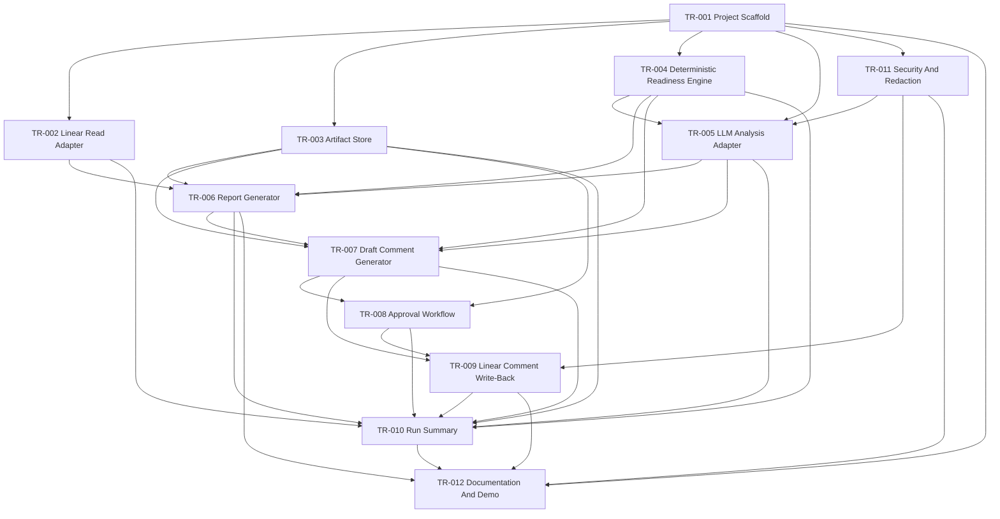

# Ticket Readiness Workflow Build Runbook

This runbook controls local planning and future Linear ticket creation for the
Ticket Readiness Workflow.

The durable product decisions live in:

- `workflows/ticket_readiness/docs/cover-sheet.md`
- `workflows/ticket_readiness/docs/detailed-specification.md`
- `frameworks/story-definition-framework.md`

The build-control package turns those decisions into prioritized,
dependency-aware work before Linear issues are created.

## Build Authority

Use this order of authority when scope or implementation details conflict:

1. `workflows/ticket_readiness/docs/detailed-specification.md`
2. `workflows/ticket_readiness/docs/cover-sheet.md`
3. `frameworks/story-definition-framework.md`
4. this runbook
5. story files under `workflows/ticket_readiness/build-control/stories/`
6. future Linear issues

Linear tracks execution. The local docs hold the planning and architecture
source of truth.

## Story Format

Each story follows:

- the base Scrum story skeleton;
- the expanded Cloud Engineer Workflows story framework;
- the story package entry and exit criteria in
  `frameworks/story-definition-framework.md`.

Each story includes:

- priority;
- tool type;
- source specification trace;
- scope boundaries;
- dependency metadata;
- dependency rationale;
- validation notes.

Every story must say what is in and what is out. This project has several
tempting future paths: Jira, scheduled runs, database persistence, provider
abstraction, UI, AWS evidence collection, and real-ticket processing. Those are
not V1 unless explicitly stated.

## Prioritization

Priorities:

- `P0`: required to prove the core workflow safely.
- `P1`: required for a usable V1 operator surface.
- `P2`: required for showcase completeness or follow-on integration.

## Build Sequence

```text
Foundation:
  TR-001 Project Scaffold
  TR-003 Artifact Store
  TR-011 Security And Redaction

Input and analysis:
  TR-002 Linear Read Adapter
  TR-004 Deterministic Readiness Engine
  TR-005 LLM Analysis Adapter

Outputs and safety:
  TR-006 Report Generator
  TR-007 Draft Comment Generator
  TR-008 Approval Workflow
  TR-009 Linear Comment Write-Back

Run visibility and completion:
  TR-010 Run Summary
  TR-012 Documentation And Demo
```

Security and artifact durability are not cleanup work. They are prerequisites
for safe workflow behavior.

## Dependency Graph



## Validation Gates

Before creating Linear issues:

- [ ] Cover sheet reviewed.
- [ ] Detailed specification reviewed.
- [ ] Story framework reviewed.
- [ ] Runbook reviewed.
- [ ] Story list reviewed.
- [ ] Story dependencies reviewed.
- [ ] Dependency rationale accepted.
- [ ] Scope boundaries accepted.
- [ ] Story package reviewed against V1 success criteria.
- [ ] Linear milestone, project, or grouping strategy confirmed.

Before implementation begins:

- [ ] Implementation repository name and location confirmed.
- [ ] Python dependency management approach confirmed.
- [ ] OpenAI API key handling documented.
- [ ] Linear access approach confirmed.
- [ ] File-backed artifact root behavior accepted.
- [ ] Manual approval record format accepted.
- [ ] Test strategy accepted.

Before V1 is considered complete:

- [ ] Sandbox Linear project can be read.
- [ ] All seeded sandbox issues can be evaluated.
- [ ] A run folder is created with manifest, events, inputs, reports, drafts,
      approvals, and summary.
- [ ] No Linear comment posts without approval.
- [ ] Approved draft comment can be posted to one sandbox issue.
- [ ] Core safety tests pass.
- [ ] Documentation explains setup, operation, approval, write-back, risks, and
      limitations.
- [ ] Security review confirms no credentials are committed or written to
      artifacts.

## Explicit Non-Goals For V1

- Jira support.
- Real employer, customer, production, or proprietary tickets.
- Scheduled automation.
- Database persistence.
- Web UI.
- Multi-provider LLM abstraction.
- AWS API access.
- Terraform or CloudFormation execution.
- Automatic Linear status changes.
- Automatic issue rewrites.
- Automatic assignment or priority changes.
- Slack or email notifications.

## Linear Creation Policy

Do not create Linear issues until the user validates this build-control package.

When approved, create milestone-level Linear issues first. Use the local story
files as source material, but do not blindly paste every detail into Linear.
Linear should remain readable and execution-oriented.

## Linear Creation Record

Linear issues were created in the Asgard AI Agency workspace on 2026-06-22:

- TR-001: ASG-49
- TR-002: ASG-50
- TR-003: ASG-51
- TR-004: ASG-52
- TR-005: ASG-53
- TR-006: ASG-54
- TR-007: ASG-55
- TR-008: ASG-56
- TR-009: ASG-57
- TR-010: ASG-58
- TR-011: ASG-59
- TR-012: ASG-60

The machine-readable mapping lives in `build-control/build-manifest.yaml`.
