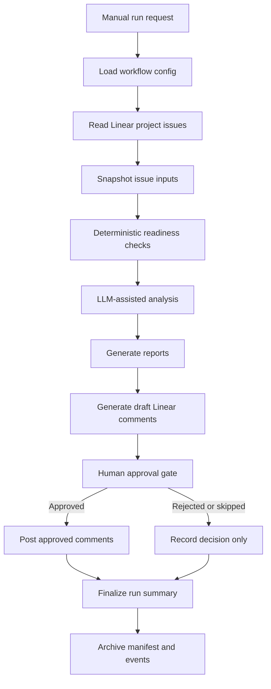

# Ticket Readiness Workflow Cover Sheet

## Title

Ticket Readiness Workflow

## One-Sentence Summary

The Ticket Readiness Workflow reviews Linear issues for cloud infrastructure
work and produces readiness reports, grooming questions, risk notes, and
human-approved draft comments before sprint commitment.

## Executive Overview

Cloud infrastructure teams lose time when tickets enter planning with unclear
outcomes, hidden operational risk, missing acceptance criteria, absent rollback
expectations, or unresolved security concerns. The Ticket Readiness Workflow
reduces that waste by evaluating Linear issues before sprint planning or
implementation work begins.

The workflow is intentionally conservative. It reads issues, snapshots evidence,
checks deterministic readiness criteria, applies LLM-assisted interpretation,
writes local reports, drafts Linear comments, and waits for human approval
before posting anything back to Linear. V1 approval is manual and file-based.
V1 uses the filesystem as a durable artifact store instead of a database so the
workflow can be built and understood without premature operational overhead.

The tool is not a deployment bot, status-change bot, or autonomous project
manager. It is a disciplined readiness reviewer that helps engineers identify
what is clear, what is missing, what is risky, and what should happen next.

## Description

The Ticket Readiness Workflow is a file-backed, human-in-the-loop workflow for
evaluating backlog issues in Linear. It is designed around infrastructure and
cloud engineering work such as AWS networking changes, IAM and EKS access
changes, Terraform module work, drift investigation, cost review, code review
prep, documentation updates, sprint planning, and incident follow-up.

For each issue, the workflow produces both a human-readable Markdown report and
a structured JSON report. It also generates a draft Linear comment that can be
reviewed and approved before posting. Each run is archived with inputs, reports,
drafts, approval records, event logs, and a manifest.

## Intended Users

This workflow is intended for:

- Cloud infrastructure engineers
- Platform engineers
- DevOps engineers
- SREs participating in backlog grooming
- Technical leads preparing sprint planning
- Engineering managers who need clearer delivery readiness signals
- AI or human development teams building workflow automation for engineering
  operations

It is especially useful for engineers who need to turn messy backlog items into
clear, reviewable, operationally safe work.

## What It Actually Does

The workflow:

- Reads issues from a configured Linear project.
- Saves a local snapshot of each issue used in the run.
- Applies deterministic readiness checks.
- Uses LLM-assisted analysis to interpret intent, missing context, and risk.
- Classifies work type and readiness status.
- Identifies missing information and grooming questions.
- Flags operational, security, rollback, ownership, and validation concerns.
- Generates Markdown and JSON readiness reports.
- Generates draft Linear comments.
- Records workflow events and run metadata.
- Requires human approval before posting any comment back to Linear.

It does not:

- Automatically change issue status.
- Automatically rewrite issue descriptions.
- Automatically assign work.
- Process Jira tickets in V1.
- Process real employer, customer, production, or proprietary tickets in V1.
- Access AWS infrastructure.
- Apply Terraform or CloudFormation changes.
- Store secrets or credentials.

## When It Performs Its Activities

The workflow is designed to run:

- Before sprint planning.
- During backlog grooming.
- Before implementation commitment.
- Before code review when a ticket lacks review context.
- During meeting preparation for infrastructure planning discussions.
- After new issues are created in the sandbox project.
- On demand when an engineer wants a readiness snapshot.

V1 is manually triggered. Scheduled runs can be added later, but only after
write-back approval and noise-control behavior are proven.

## How It Works

At a high level, the workflow reads Linear issues, evaluates them, saves local
evidence, drafts feedback, and stops at a human approval gate before any
external write-back.

The design separates deterministic checks from LLM interpretation. Deterministic
checks handle required fields, explicit signals, and guardrails. LLM analysis
uses the OpenAI API directly in V1 to handle language understanding, ticket
intent, and nuanced grooming feedback. Neither layer is allowed to bypass the
manual human approval gate.

## Why This Exists

This workflow exists because infrastructure delivery is often slowed down by
unclear work intake rather than code difficulty.

It reduces or eliminates:

- Sprint planning churn caused by vague tickets.
- Repeated grooming conversations about the same missing information.
- Hidden operational risk in tickets that look small.
- Code reviews blocked by absent context or acceptance criteria.
- Security and rollback concerns discovered too late.
- Meeting prep overhead for backlog and scrum planning.
- Manual ticket triage that varies wildly by reviewer.
- AI-generated process noise caused by uncontrolled write-back.

The practical goal is better engineering judgment at the intake boundary. The
tool should help teams ask better questions before they commit to work.
